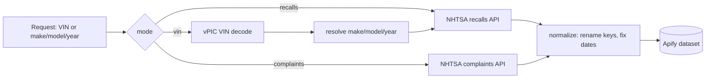

# NHTSA Recall Monitor

One API to pull vehicle recalls, complaints, and VIN decodes from NHTSA, normalized into clean rows you can drop straight into a dataset.

[](https://apify.com/george.the.developer/nhtsa-recall-monitor?source=github-nhtsa)
[](https://apify.com/george.the.developer/nhtsa-recall-monitor?source=github-nhtsa)
[](https://apify.com/george.the.developer/nhtsa-recall-monitor?source=github-nhtsa)
[](https://www.nhtsa.gov/)

This is the docs repo. The actor itself runs on Apify: **[george.the.developer/nhtsa-recall-monitor](https://apify.com/george.the.developer/nhtsa-recall-monitor?source=github-nhtsa)**.

---

## What it does

The actor wraps the public NHTSA data services and gives you one consistent output shape across three different lookup paths.

- **Recall lookup.** Pull every open and historical safety recall for a vehicle by make, model, and year. Each row has the campaign number, the affected component, the plain-English summary, the consequence, and the remedy. This is the same data behind the **NHTSA recall API** that powers the recalls.gov lookup, just normalized.
- **Complaint lookup.** Pull owner-filed complaints (the ODI database) for the same vehicle. Each row carries the ODI number, the component, crash/fire/injury/death flags, the incident and filed dates, and the partial VIN. Useful for spotting a defect trend before it becomes a formal recall.
- **VIN decode plus recall check.** Feed a 17-char VIN. The actor decodes it through the vPIC service to resolve make, model, year, body style, and plant, then runs the **VIN recall check** against the recall feed so you get a per-vehicle recall report in one call.

Everything comes back as flat JSON rows. No nested junk to flatten on your side, no scraping, no HTML parsing. NHTSA serves this data straight, so the actor is just normalization plus batching plus billing.

---

## Why

NHTSA exposes the data, but it is split across three services that do not agree on anything.

- The recalls endpoint returns `PascalCase` keys (`NHTSACampaignNumber`, `ReportReceivedDate`).
- The complaints endpoint returns `camelCase` keys (`odiNumber`, `dateComplaintFiled`) plus a nested `products` array.
- vPIC (VIN decode) returns a wide flat object with 130+ fields, most of them empty strings.
- Dates show up as `DD/MM/YYYY` in recalls and `MM/DD/YYYY` in complaints. Yes, really.
- Investigations live in yet another feed with its own shape.

So every team that touches **car recall data** writes the same glue: rename keys, fix the date formats, drop the empty vPIC columns, merge recalls with complaints on make/model/year. Then they cache it, schedule it, and babysit the rate limits. That glue is boring and it breaks quietly when NHTSA tweaks a field.

This actor is that glue, written once. You hand it a vehicle or a VIN, it hands back rows that already line up. One date format. One naming convention. Recall rows and complaint rows you can union without thinking. If you need a **recall data feed** on a schedule, point a daily Apify task at it and read the dataset.

---

## Flow



---

## Endpoints

The actor runs in **standby mode** (instant HTTP, no cold start) and in **batch mode** (run-sync or async task). Standby exposes three GET routes.

### GET /recalls

Safety recalls for a vehicle.

| Param | Required | Example | Notes |
|-------|----------|---------|-------|
| `make` | yes | `honda` | manufacturer, case-insensitive |
| `model` | yes | `accord` | model name |
| `modelYear` | yes | `2021` | 4-digit year |

### GET /complaints

Owner-filed complaints (ODI) for a vehicle.

| Param | Required | Example | Notes |
|-------|----------|---------|-------|
| `make` | yes | `honda` | manufacturer |
| `model` | yes | `accord` | model name |
| `modelYear` | yes | `2021` | 4-digit year |

### GET /vin

Decode a VIN and check it against the recall feed.

| Param | Required | Example | Notes |
|-------|----------|---------|-------|
| `vin` | yes | `5J6RW2H89ML000000` | 17-char VIN |
| `recalls` | no | `true` | also return recalls for the decoded vehicle |

---

## Output schema

All rows are flat JSON. A `recordType` field tells you which shape you are looking at when you union recall and complaint rows in one dataset.

### Recall row

| Field | Type | Source | Description |
|-------|------|--------|-------------|
| `recordType` | string | actor | always `recall` |
| `campaignNumber` | string | `NHTSACampaignNumber` | NHTSA campaign ID, e.g. `21V900000` |
| `manufacturer` | string | `Manufacturer` | recalling manufacturer |
| `make` | string | `Make` | vehicle make, uppercased by NHTSA |
| `model` | string | `Model` | vehicle model |
| `modelYear` | integer | `ModelYear` | model year |
| `component` | string | `Component` | affected system, e.g. `AIR BAGS:SENSOR` |
| `summary` | string | `Summary` | what is wrong, plain English |
| `consequence` | string | `Consequence` | what can happen if not fixed |
| `remedy` | string | `Remedy` | the fix and who to contact |
| `reportReceivedDate` | string (ISO) | `ReportReceivedDate` | normalized to `YYYY-MM-DD` |
| `parkIt` | boolean | `parkIt` | do-not-drive warning |
| `parkOutside` | boolean | `parkOutSide` | fire risk, park away from structures |
| `overTheAirUpdate` | boolean | `overTheAirUpdate` | fix delivered OTA |
| `notes` | string | `Notes` | extra contact info |

### Complaint row

| Field | Type | Source | Description |
|-------|------|--------|-------------|
| `recordType` | string | actor | always `complaint` |
| `odiNumber` | integer | `odiNumber` | NHTSA ODI complaint ID |
| `manufacturer` | string | `manufacturer` | manufacturer named in complaint |
| `make` | string | `products[].productMake` | vehicle make |
| `model` | string | `products[].productModel` | vehicle model |
| `modelYear` | integer | `products[].productYear` | model year |
| `component` | string | `components` | affected component |
| `summary` | string | `summary` | the owner's narrative |
| `crash` | boolean | `crash` | crash involved |
| `fire` | boolean | `fire` | fire involved |
| `numberOfInjuries` | integer | `numberOfInjuries` | injuries reported |
| `numberOfDeaths` | integer | `numberOfDeaths` | deaths reported |
| `vin` | string | `vin` | partial VIN as filed |
| `dateOfIncident` | string (ISO) | `dateOfIncident` | normalized to `YYYY-MM-DD` |
| `dateComplaintFiled` | string (ISO) | `dateComplaintFiled` | normalized to `YYYY-MM-DD` |

### VIN report row

| Field | Type | Source | Description |
|-------|------|--------|-------------|
| `recordType` | string | actor | always `vinReport` |
| `vin` | string | input | the 17-char VIN |
| `make` | string | vPIC `Make` | decoded make |
| `model` | string | vPIC `Model` | decoded model |
| `modelYear` | integer | vPIC `ModelYear` | decoded year |
| `bodyClass` | string | vPIC `BodyClass` | body style |
| `plantCountry` | string | vPIC `PlantCountry` | assembly country |
| `recallCount` | integer | actor | recalls matched to the decoded vehicle |
| `recalls` | array | actor | recall rows (same shape as above) when `recalls=true` |

---

## Quick start

Replace `<APIFY_TOKEN>` with your token from the Apify console. The username slug uses dots, not hyphens: `george.the.developer~nhtsa-recall-monitor`.

### cURL (run-sync, get the dataset back)

```bash
curl -X POST "https://api.apify.com/v2/acts/george.the.developer~nhtsa-recall-monitor/run-sync-get-dataset-items?token=<APIFY_TOKEN>" \
  -H "Content-Type: application/json" \
  -d '{
    "mode": "recalls",
    "vehicles": [
      { "make": "honda", "model": "accord", "modelYear": 2021 }
    ]
  }'
```

### Node.js (apify-client)

```js
import { ApifyClient } from 'apify-client';

const client = new ApifyClient({ token: process.env.APIFY_TOKEN });

const run = await client.actor('george.the.developer/nhtsa-recall-monitor').call({
  mode: 'recalls',
  vehicles: [
    { make: 'honda', model: 'accord', modelYear: 2021 },
  ],
});

const { items } = await client.dataset(run.defaultDatasetId).listItems();
console.log(items);
```

### Python (apify-client)

```python
from apify_client import ApifyClient
import os

client = ApifyClient(os.environ["APIFY_TOKEN"])

run = client.actor("george.the.developer/nhtsa-recall-monitor").call(run_input={
    "mode": "recalls",
    "vehicles": [
        {"make": "honda", "model": "accord", "modelYear": 2021},
    ],
})

for item in client.dataset(run["defaultDatasetId"]).iterate_items():
    print(item)
```

---

## Examples

Sample inputs and real API output live in [`examples/`](examples/).

- [`examples/input-recalls.json`](examples/input-recalls.json): batch recall lookup for three vehicles.
- [`examples/input-vin.json`](examples/input-vin.json): VIN decode plus recall check.
- [`examples/sample-recall.json`](examples/sample-recall.json): real NHTSA recall response (2021 Honda Accord).
- [`examples/sample-complaint.json`](examples/sample-complaint.json): real NHTSA complaint response (2021 Honda Accord).

These samples were pulled live from the public NHTSA endpoints and trimmed to two records each. Nothing here is synthetic.

A recall record straight from the source (`make=honda&model=accord&modelYear=2021`):

```json
{
  "Manufacturer": "Honda (American Honda Motor Co.)",
  "NHTSACampaignNumber": "21V900000",
  "parkIt": false,
  "parkOutSide": false,
  "overTheAirUpdate": false,
  "ReportReceivedDate": "18/11/2021",
  "Component": "SEAT BELTS:REAR/OTHER:RETRACTOR",
  "Summary": "Honda (American Honda Motor Co.) is recalling certain 2021 Accord Sedan, Accord Hybrid, CR-V, Ridgeline, 2022 Insight and CR-V Hybrid vehicles...",
  "Consequence": "An unsecured child restraint system can increase the risk of injury during a crash.",
  "Remedy": "Dealers will replace the second-row center seat belt assembly, free of charge...",
  "ModelYear": "2021",
  "Make": "HONDA",
  "Model": "ACCORD"
}
```

A complaint record from the ODI feed:

```json
{
  "odiNumber": 11741504,
  "manufacturer": "Honda (American Honda Motor Co.)",
  "crash": false,
  "fire": false,
  "numberOfInjuries": 0,
  "numberOfDeaths": 0,
  "dateOfIncident": "05/18/2026",
  "dateComplaintFiled": "06/02/2026",
  "vin": "1HGCV1F3XMA",
  "components": "ELECTRICAL SYSTEM",
  "summary": "Odometer Fraud. The contact purchased a 2021 Honda Accord...",
  "products": [
    { "type": "Vehicle", "productYear": "2021", "productMake": "HONDA", "productModel": "ACCORD" }
  ]
}
```

Notice the two date formats and the casing mismatch across the two responses. The actor flattens both into one schema so you stop writing that adapter yourself.

---

## Pricing

Pay per event. You pay for the run plus the records you actually get back, nothing for empty lookups.

| Event | Price |
|-------|-------|
| Actor start | $0.25 |
| Recall record | $0.02 |
| Complaint record | $0.01 |
| VIN report | $0.05 |

PPE billing goes live on the actor on **2026-06-24**. Before that the actor runs on platform compute pricing.

---

## Use cases

**Auto dealers.** Run a VIN through `/vin` before a used car hits the lot and surface open recalls in the listing. Buyers trust a dealer that flags the airbag recall up front instead of hiding it.

**Insurers and underwriters.** Pull complaint trends by make/model/year to price risk on a model line. A spike in fire or crash complaints months before a formal recall is a signal you want in the model.

**Lemon-law and class-action firms.** Pull every complaint and recall for a vehicle to build the paper trail for a case. The ODI narratives and campaign numbers are exactly the evidence these filings reference.

**Fleet managers.** Batch-check a whole fleet by VIN on a schedule and get a recall feed for every vehicle you operate. Catch the do-not-drive `parkIt` flag before a truck rolls.

**Used-car marketplaces.** Enrich every listing with a live **vehicle recall lookup** so shoppers see safety status next to mileage and price. Cleaner listings, fewer post-sale disputes.

---

## FAQ

**How do I look up recalls by VIN?**
Send the 17-char VIN to the `/vin` endpoint with `recalls=true`, or use `mode: "vin"` in batch input. The actor decodes the VIN through vPIC to resolve the vehicle, then matches it against the recall feed and returns a per-VIN recall report.

**Is NHTSA recall data free?**
Yes. NHTSA publishes recalls, complaints, and VIN decode data through public endpoints with no API key. The actor charges for normalization, batching, and the managed run, not for the underlying data, which stays free and public.

**How often is the data updated?**
NHTSA updates the recalls and complaints feeds continuously as manufacturers file campaigns and owners file complaints. The actor reads live on every run, so you get the current state. Schedule a daily Apify task if you want a standing **recall data feed**.

**What is the difference between a recall and a complaint?**
A recall is a formal manufacturer or NHTSA action on a known defect, with a campaign number and a remedy. A complaint is an individual owner report in the ODI database. Complaints often cluster before a recall, so watching the **NHTSA complaints API** data is an early-warning signal.

**Do I get rate limited?**
The actor handles NHTSA's limits for you with batching and retries. You hit the Apify run, not NHTSA directly, so there is nothing to throttle on your end.

---

## Run it at scale

Single lookups are fine from the standby endpoint. For thousands of vehicles, scheduled **automotive recall monitoring**, or a recurring **safety recall API** feed into your warehouse, run the actor on Apify and read the dataset.

**[Open NHTSA Recall Monitor on Apify](https://apify.com/george.the.developer/nhtsa-recall-monitor?source=github-nhtsa)**

Data source: [NHTSA](https://www.nhtsa.gov/). This project is not affiliated with or endorsed by NHTSA.
